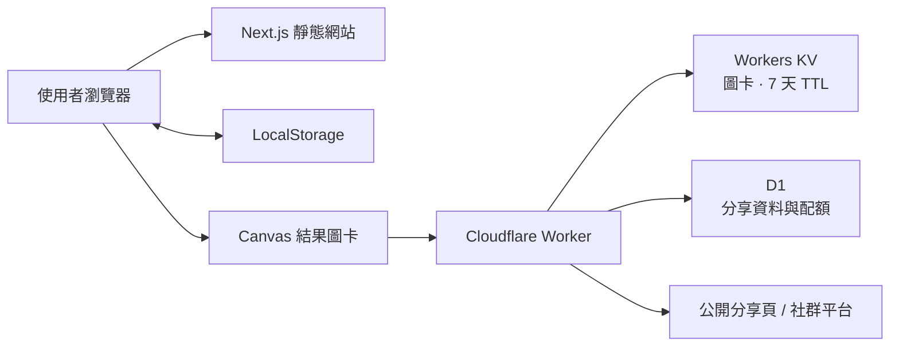

# 好奇一下 Curio Lab

<p align="center">
  
  
  
</p>

<p align="center">
  把那些「一直有點想知道」的問題，做成簡單好玩的工具。
</p>

<p align="center">
  <a href="https://www.curio-lab.workers.dev"><strong>開啟正式網站</strong></a>
  ·
  <a href="https://www.curio-lab.workers.dev/tools/cat-cost">主子帳本</a>
  ·
  <a href="https://www.curio-lab.workers.dev/tools/cat-personality">16 型貓格</a>
</p>

Curio Lab 是一個以台灣繁體中文設計的互動工具實驗室。這裡的結果不一定是標準答案，更像是一個重新觀察生活的起點：用幾分鐘整理一個平常不容易算清楚、卻又忍不住想知道的問題。

## 現有工具

### 主子帳本

從貓咪來到家裡到現在，依目前的日常消費模式，估算一起生活期間的大約花費。

- 分步填寫相處時間與各類支出
- 提供台灣常見消費模式預設值
- 整理總額、每月平均、每日平均與支出占比
- 產生 1080 × 1350 結果圖卡與 QR Code

[開始計算](https://www.curio-lab.workers.dev/tools/cat-cost)

### 16 型貓格

用 20 個日常情境與四個具體行為選項，找出最接近家中貓咪的行為類型。

- 16 題雙向度題目加上 4 題校準題
- 每個向度都有奇數次判斷，不會出現平手
- 16 種貓格名稱、介紹與獨立手繪插圖
- 支援續答、結果圖卡與社群分享

[開始測驗](https://www.curio-lab.workers.dev/tools/cat-personality)

<table>
  <tr>
    <td align="center"><br /><strong>紙箱發明家</strong></td>
    <td align="center"><br /><strong>月光讀心師</strong></td>
    <td align="center"><br /><strong>客廳親善大使</strong></td>
    <td align="center"><br /><strong>靜音獵手</strong></td>
  </tr>
</table>

## 分享架構

測驗答案與計算資料優先保留在瀏覽器。使用者主動分享時，前端才會產生圖卡；設定分享 API 後，可建立最長 7 天的公開連結。



雲端分享支援 Facebook、LINE、Instagram、Threads、複製連結與圖片下載；沒有設定 API 時，網站仍可使用本機分享與下載。

## 技術組成

| 範圍 | 技術 |
|---|---|
| 前端 | Next.js 16、React 19、TypeScript 6 |
| 網站輸出 | Next.js static export |
| 圖卡 | Canvas API、QRCode |
| 分享 API | Cloudflare Workers |
| 儲存 | Workers KV、D1 |
| 測試 | Node.js 測試腳本、TypeScript、ESLint |

## 本機啟動

需要 Node.js 與 npm。

```bash
npm install
npm run dev
```

開啟 `http://localhost:3000`。

若要在本機前端連接已部署的分享 API，可建立 `.env.local`：

```bash
NEXT_PUBLIC_SHARE_API_URL=https://api.curio-lab.workers.dev
```

未設定時會使用本機分享流程。

## 驗證

```bash
npm run typecheck
npm run lint
npm test
npm run build
```

目前測試涵蓋計算器、16 型貓格計分，以及 Worker 免費配額保護邏輯。

## 部署

建立正式靜態輸出：

```powershell
$env:NEXT_PUBLIC_SHARE_API_URL='https://api.curio-lab.workers.dev'
npm.cmd run build
npx.cmd wrangler deploy --config wrangler.site.jsonc
```

分享 Worker 的資源設定、資料庫 migration、配額與部署流程請見 [worker/README.md](worker/README.md)。

## 專案結構

```text
app/                     Next.js 頁面與全站樣式
lib/calculator/          主子帳本計算與圖卡
lib/cat-personality/     題庫、計分、結果與圖卡
lib/share/               雲端分享前端介面
public/cat-personality/  16 張貓格插圖
tests/                   自動化測試
worker/                  Cloudflare 分享 API、KV 與 D1
```

## 隱私

測驗答案與計算資料儲存在使用者的瀏覽器。只有在使用者主動按下分享結果時，圖卡與分享文案才會上傳，並建立最長 7 天的公開連結。

